# OpenWrt settings

### 环境：

192.168.1.211 是软路由位置，和其他设备都位于局域网下，原理其实挺简单的：以手机为例，数据链路如下
192.168.1.12→192.168.1.211→192.168.1.1→运营商 IP；核心就是设置各自的网关。

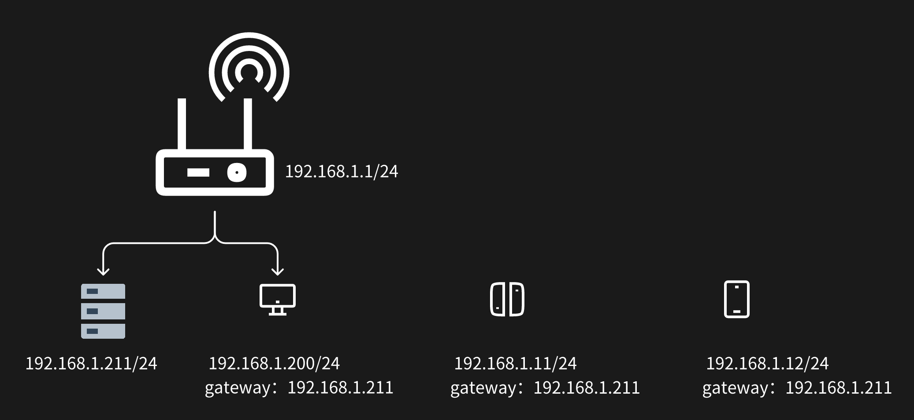

- 首次登录应该不用密码，用户名是 root，进入管理端后，导航到 系统-管理权-主机密码修改。

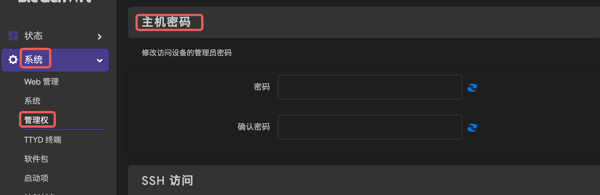

- 虚拟机安装好镜像后，默认 ip 是 192.168.1.1，和上一级路由冲突，因此需要用 ssh 登录去修改 lan 口的 ip。配置文件位于`/etc/config/network`，自行修改，需要重启生效，执行 `reboot` 。

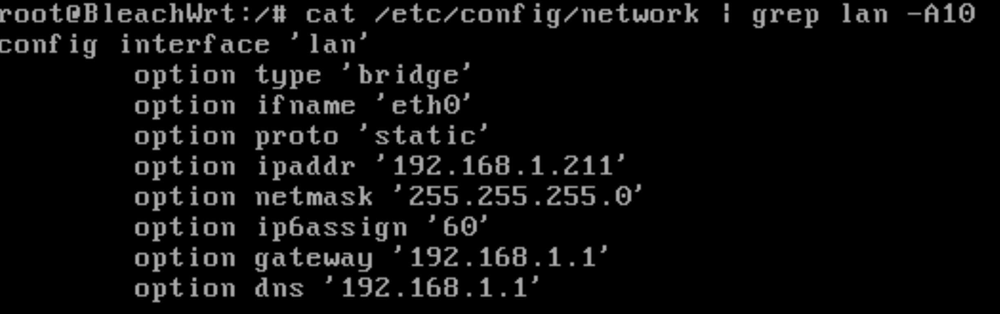

### 网络接口设置

- 导航到 网络-接口

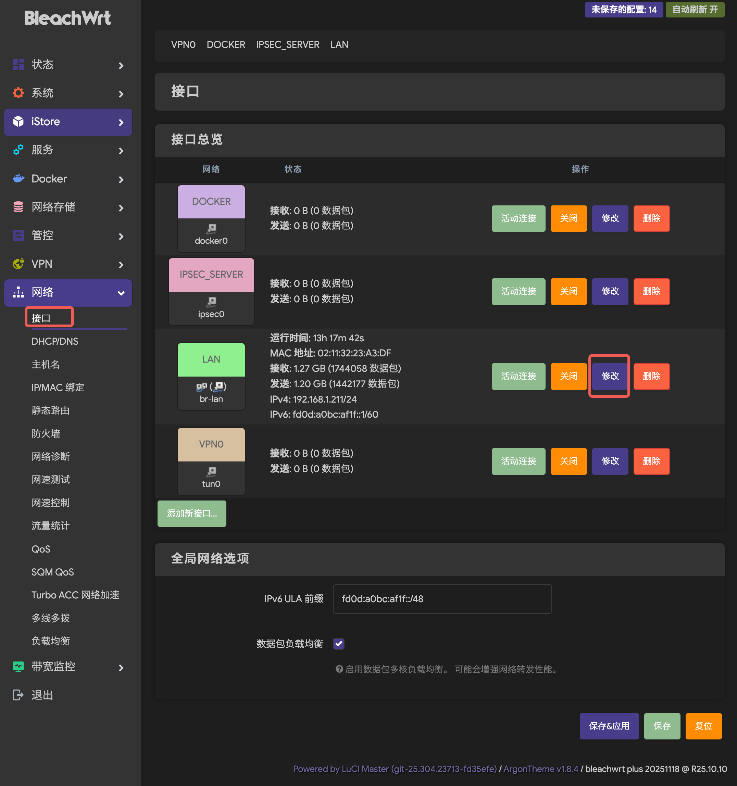

- 导航到 网络-接口-一般配置-基本设置

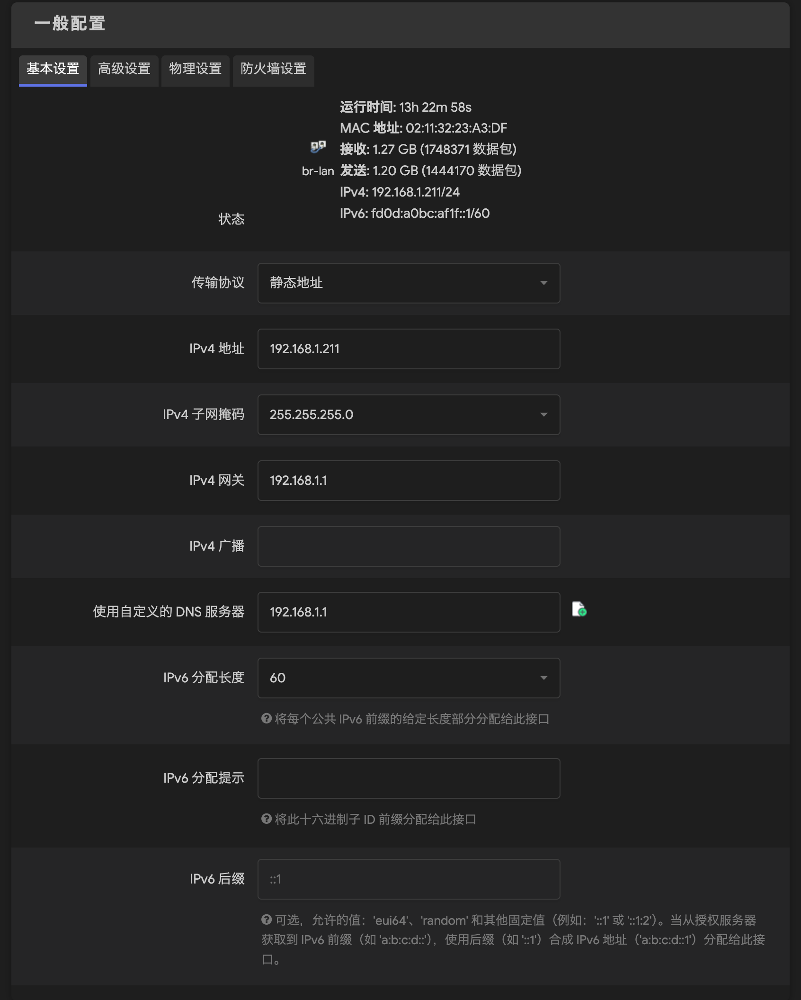

- 导航到 网络-接口-一般配置-高级设置

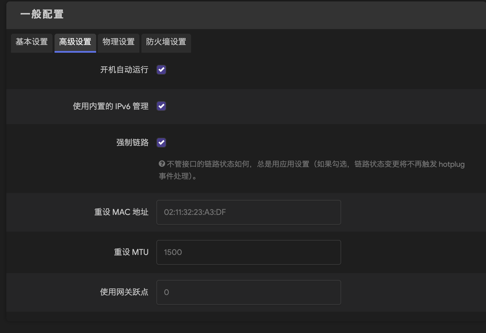

- 导航到 网络-接口-一般配置-物理设置

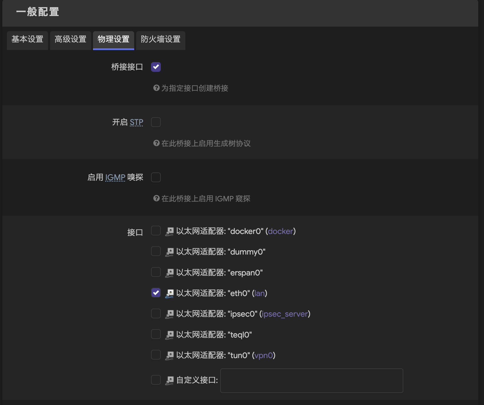

- 导航到 网络-接口-一般配置-防火墙设置

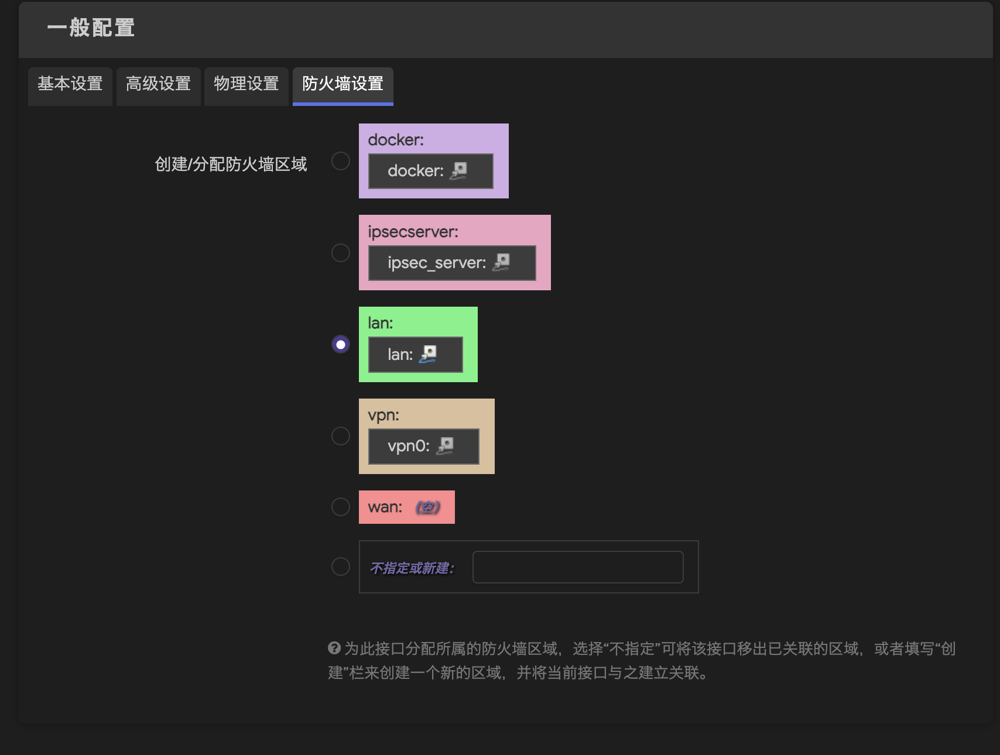

- 导航到 网络-接口-DHCP 服务器-基本设置

- 导航到 网络-接口-DHCP 服务器-IPv6 设置

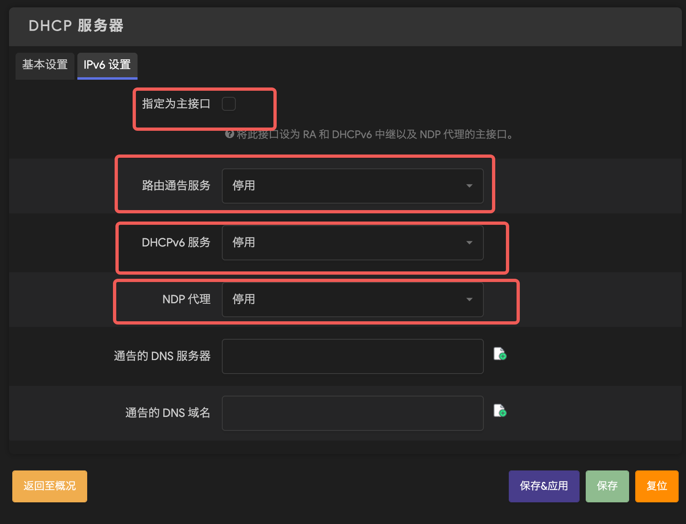

### 防火墙设置

- 导航到 网络-防火墙

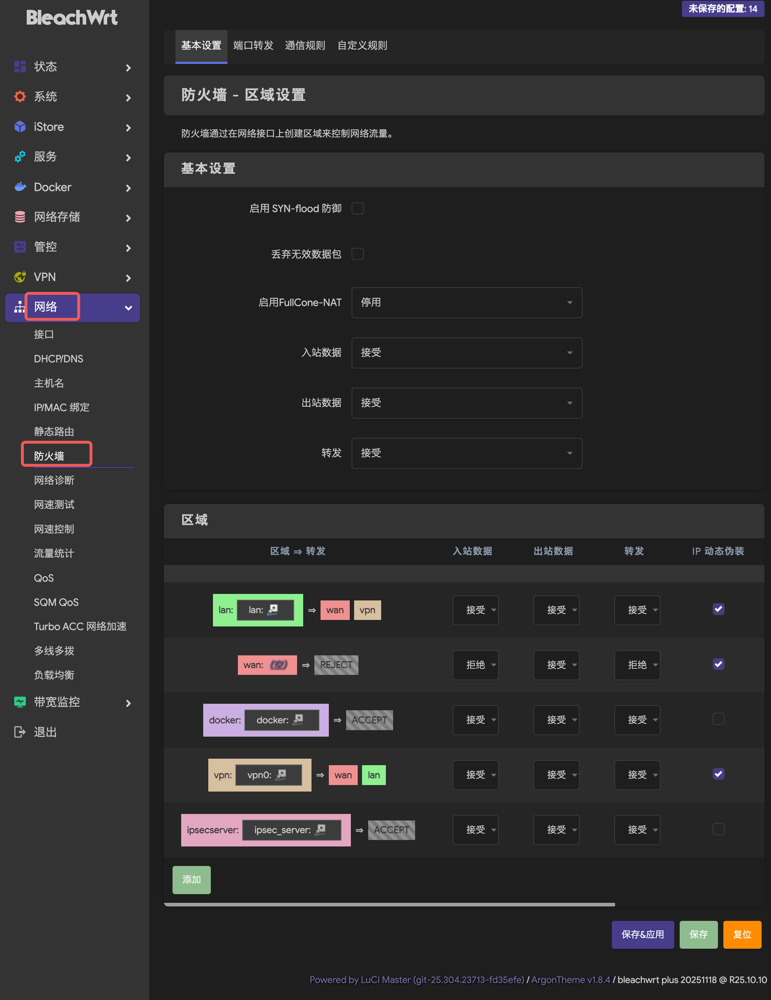

- 导航到网络-防火墙-基本设置

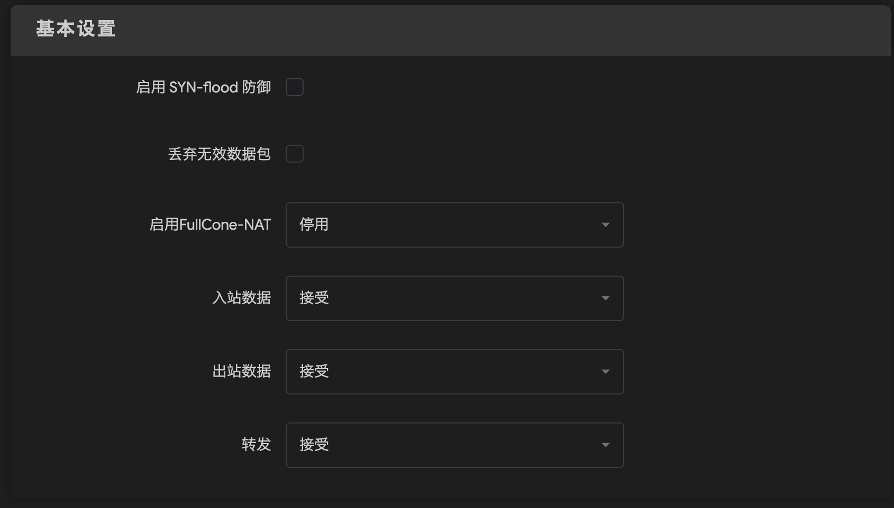

- 导航到网络-防火墙-区域

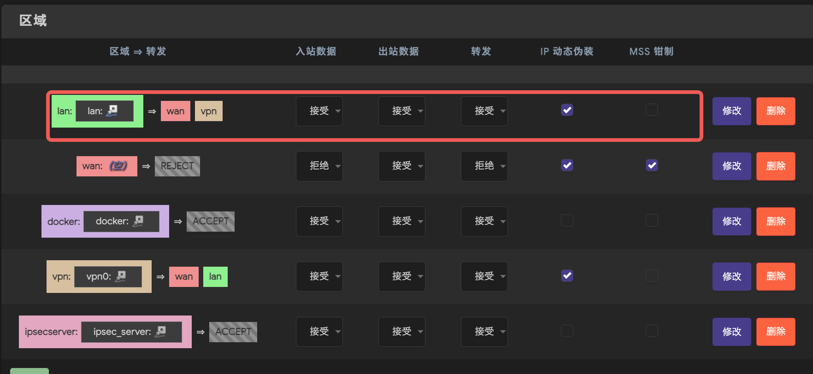

### 网络诊断

- 导航到网络-网络诊断，可以测试 PING、TRACEROUTE、NSLOOKUP

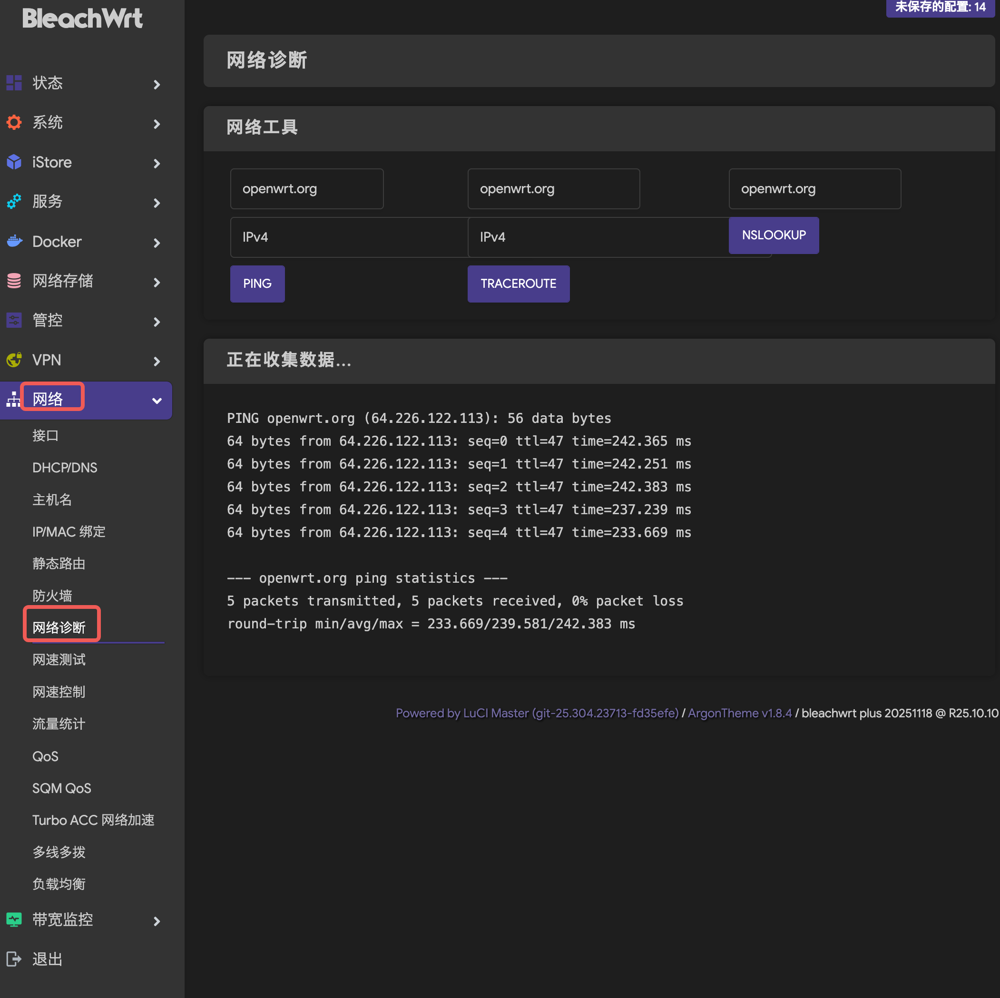

### 配置代理

导航到 服务-ShadowSocksR Plus+，找一个用的顺手的 client 就行，ios 用 ssr 小火箭习惯了，而且它的配置比较简单，同时支持vless+ws+tls、vless+xtls+reality、tuic，非常适合作为client。导入你订阅节点的信息就行了。

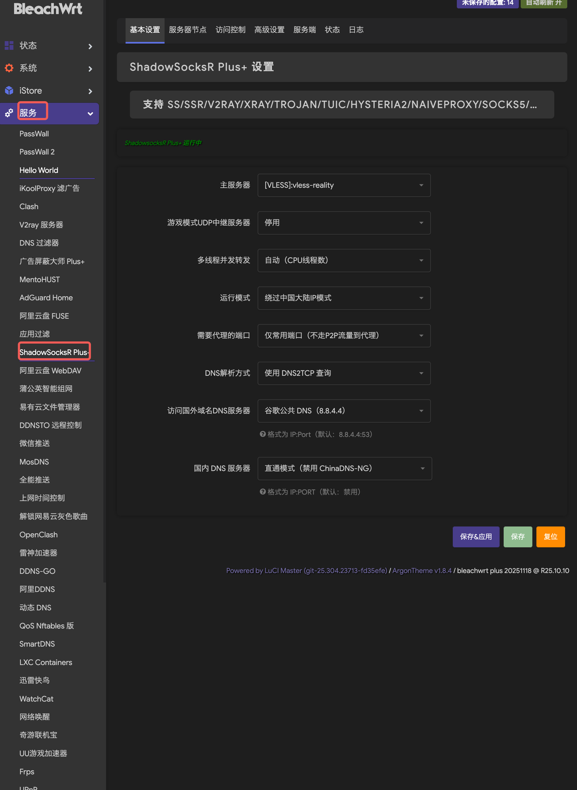